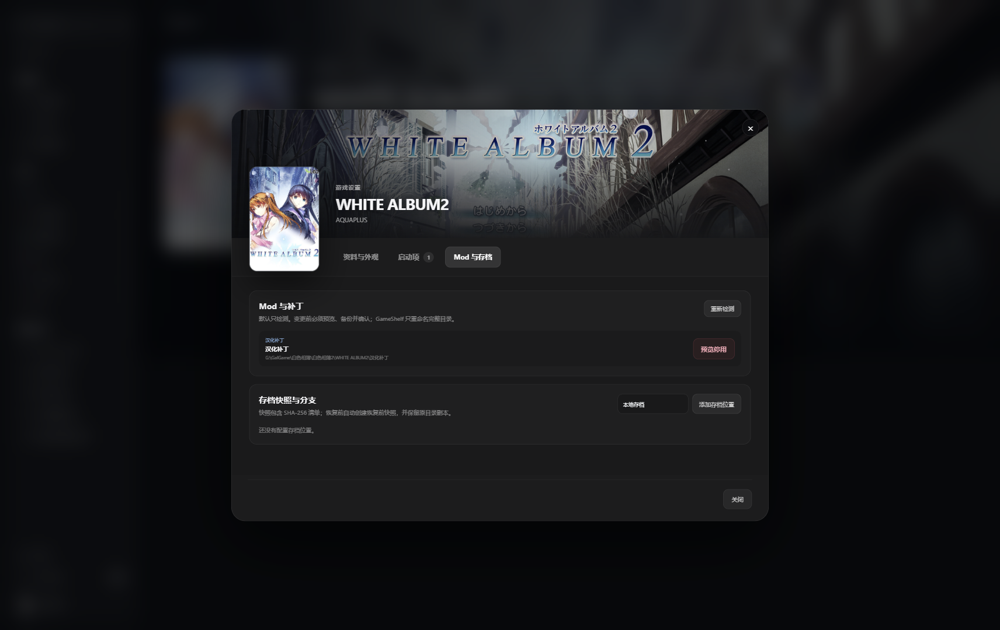

<div align="center">
  
  <h1>GameShelf</h1>
  <p><strong>把散落在硬盘里的游戏，整理成一座真正属于你的私人游戏库。</strong></p>
  <p>Windows · Local-first · Visual novels & local games</p>

  <p>
    
    
    
    
    
  </p>
</div>

---

<div align="center">
  
</div>

---

GameShelf 是一款面向 Windows 本地游戏的桌面管理器。它不区分游戏来自哪个平台，也不要求游戏必须是 Galgame：只要能在本机运行，就可以用统一的封面、资料、启动项、分类与游玩记录来管理。

它的重点不是再造一个商店，而是让已有的本地收藏更好找、更好看，也更容易正确启动。

## 现在可以做什么

| 整理 | 游玩 | 隐私 |
| --- | --- | --- |
| 批量扫描审核、封面墙/信息列表、搜索、状态与自定义分类 | 默认启动项与原版、汉化版、补丁版等多启动项 | 敏感游戏可在安全视图中完全隐藏 |
| 原名与中文名独立保存、全局切换 | 自动记录启动次数、最近游玩与游玩时长 | 数据库、图片和记录默认只保存在本机 |
| 缺失封面检查、批量状态/分类/合集/隐私整理 | 游戏设置中直接打开所在文件夹 | 移出游戏库不会删除游戏本体或存档 |

1.0.0 汇总了 0.3/0.4 已验证的游戏库、Package、存档与安全视图能力，并提供可持续构建的 Windows 安装版和便携版。详见 [变更记录](CHANGELOG.md)、[安装、升级与便携使用](docs/INSTALLATION.md) 和 [Package 与存档安全](docs/PACKAGES-AND-SAVES.md)。

## GameShelf 的设计方向

**像内容库，而不是文件启动器。** 主页负责继续游玩与回顾收藏，游戏库负责查找，详情页负责启动；不同页面各自有明确目的。

**本地优先。** 游戏文件仍留在原来的硬盘位置。GameShelf 只保存索引、用户设置、复制后的封面和游玩记录。

**一个游戏，多种玩法。** 同一条目可以维护多个启动项，用来区分原版、汉化版、全年龄版或补丁版，而不必在书库里制造重复游戏。

## 功能状态

后续开发安排见 [项目路线图](docs/ROADMAP.md)。

- [x] 本地 SQLite 游戏库
- [x] 深色 / 浅色外观
- [x] 中文名 / 原名双标题
- [x] 自定义分类与系列合集
- [x] 多启动项与游玩统计
- [x] 批量扫描审核、重复/多版本提示与批量整理
- [x] 封面墙和信息列表、缺失封面检查
- [x] 本地安全视图
- [x] 可预览、备份、撤销的 Mod 与补丁目录管理
- [x] 带 SHA-256 校验的存档快照、恢复与分支
- [x] 系列作品顺序与整体进度
- [ ] Locale Emulator、脚本与 Magpie 启动助手
- [ ] 可选择的元数据提供方

## 数据与隐私

GameShelf 不上传游戏列表、封面、启动路径或游玩记录。安装版把受管数据放在 `%APPDATA%\GameShelf`，升级不会替换该目录；便携版通过程序旁的 `gameshelf-portable` 标记把数据放在同目录的 `data`。游戏本体保持在用户原有目录中。

数据库备份保存在当前数据目录的 `backups`，崩溃日志保存在 `logs`。数据库备份包含游戏索引、设置、合集、启动项和游玩记录；封面与背景仍留在当前数据目录中，不会在恢复数据库时被覆盖。需要完整迁移时，请先退出 GameShelf，再复制整个数据目录。

“移出游戏库”只删除 GameShelf 中的索引与关联记录，不会删除游戏目录。批量扫描只读游戏目录；导入只写入 GameShelf 的数据库和受管封面目录。

Package 变更会把完整目录在原位置与 `.gameshelf-disabled` 名称之间重命名，并先在当前数据目录的 `package-backups` 创建带校验清单的备份。存档快照保存在 `save-snapshots`；恢复后，原存档目录会以 `.gameshelf-restore-old-*` 名称保留在同级位置，供人工回退。安全视图是界面隐藏能力，不是磁盘加密，也不会隐藏 GameShelf 以外的文件。

## 安装与更新

从 [GitHub Releases](https://github.com/CSQ-AN94/GameShelf/releases/latest) 下载 Windows x64 安装版或便携 ZIP，并使用同页的 `SHA256SUMS.txt` 校验文件。安装版、便携版之间的迁移与覆盖更新步骤见 [安装、升级与便携使用](docs/INSTALLATION.md)。

## 本地开发

需要 Node.js 24 与 Windows 环境：

```bash
npm install
npm start
```

运行检查：

```bash
npm run typecheck
npm test
```

构建 Windows 安装版与便携版：

```bash
npm run make:installer
npm run make:portable
```

GitHub Actions 会在 pull request、`main` 和版本 tag 上重复 typecheck、测试、生产依赖审计与两个 Windows 构建。

## 灵感与致谢

GameShelf 从 [PotatoVN](https://github.com/GoldenPotato137/PotatoVN)、[LunaBox](https://github.com/Saramanda9988/LunaBox) 与 [Playnite](https://github.com/JosefNemec/Playnite) 的开源实践中学习了本地游戏管理的思路；界面则探索适合 Windows 的内容库式桌面体验。项目没有复制这些应用的界面、品牌或代码。

---

<div align="center">
  <sub>GameShelf 1.0 · Built for a private local library</sub>
</div>
